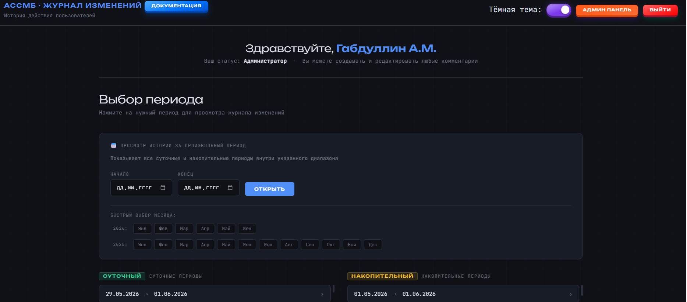

# АССМБ — Журнал изменений

Web-приложение для просмотра и аудита ручных корректировок в системе балансировки материальных потоков (АССМБ).



---

## Stack

- **Backend** — Python 3.11, FastAPI, pyodbc
- **Frontend** — Jinja2, vanilla JS, Chart.js, SheetJS
- **Database** — Microsoft SQL Server

## Features

- Просмотр журнала изменений по периодам (суточный / накопительный / произвольный)
- Добавление и редактирование комментариев с контролем конфликтов
- Система признаков с настраиваемыми пресетами
- Ролевая модель доступа (наблюдатель / пользователь / главный / администратор)
- Статистика изменений с графиками
- Экспорт в Excel
- Журнал посещений
- Тёмная и светлая тема

## Setup

```bash
git clone https://github.com/theroonekz/assmb-changelog-viewer.git
cd assmb-changelog-viewer

pip install -r requirements.txt

cp .env.example .env
# Открыть .env и заполнить параметры подключения

uvicorn main:app --host 0.0.0.0 --port 8000
```

## Configuration

Все чувствительные параметры задаются через `.env`:

```
SECRET_KEY=...
DB_SERVER=...
DB_MB4=MB4
DB_REPORT=TestReport
DB_USER=...
DB_PASSWORD=...
```

## Screenshots

<!-- Вставь скриншоты сюда -->

---

*Deployed as a Windows service via NSSM on an internal application server.*
